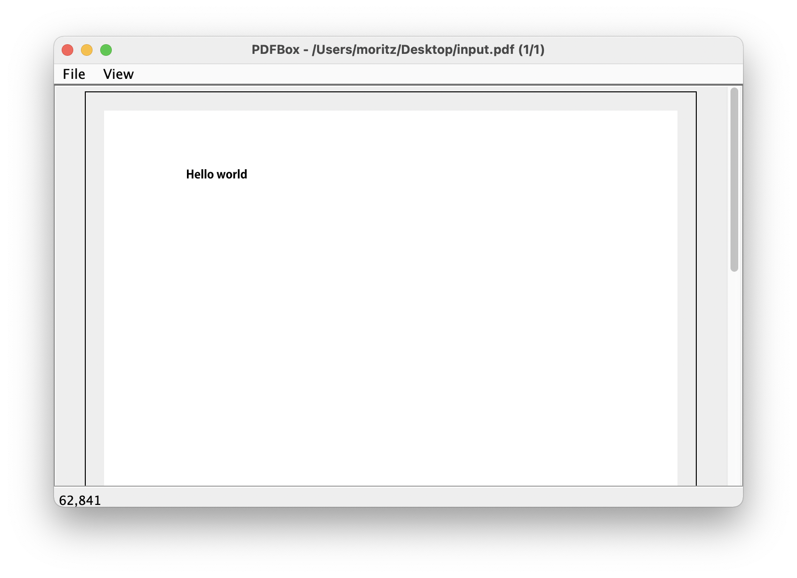

# pdfbox3-pdfreader
A simple reader application for PDFBox 3 based on the code of the PDFBox 1 PDFReader Application Example.

The original application was written by Ben Litchfield and published together with PDFBox 1.

The code was written and the application compiled and tested with Java 16.

